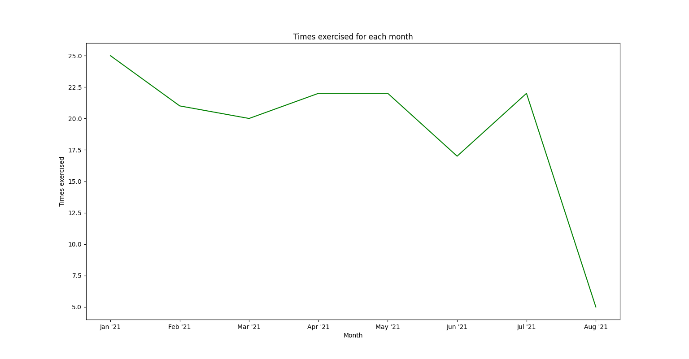
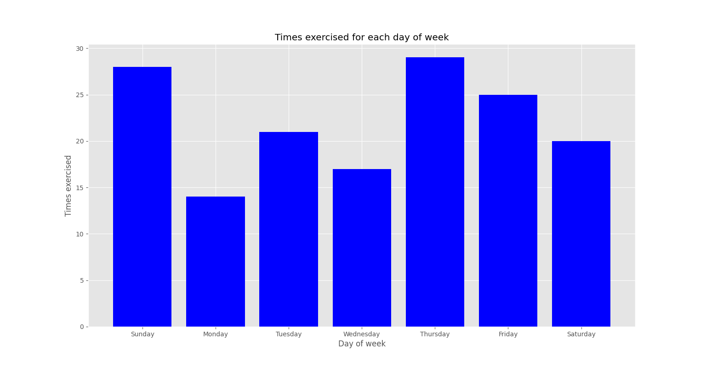
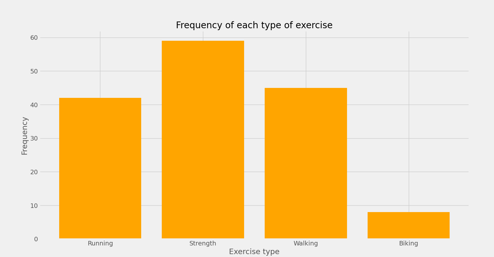

# Exercise Tracking and Visualization

This project provides a way to track and visualize your exercise habits. It provides 3 charts for
visualizing your exercises.


## Setup

Assuming you are using a Linux machine:

```sh
$ python3 -m venv .venv
$ source .venv/bin/activate
$ pip3 install -r requirements.txt
```

## Usage

```sh
$ python3 
```

You should then see 3 plots appear, one at a time, one after the other.

## Plots

The first plots the number of times you exercised versus the month.




The second plots the number of times you exercised versus a particular day of week.




The third plots the number of times you performed a particular exercise type.




In addition, I have also provided an
[Excel spreadsheet template](doc/exercise_tracker_template.xlsx) for others to track their exercise
habits as well. The years and months should be integers and strings, respectively. Each column after
the year and month represents an exercise; remove or add rows as required for your exercise habits
and needs. Each cell in the exercise columns should be a comma separated list of integers, surrounded
by brackets, that represent the days exercised for that particular year and month.


## Running Tests

To run unit tests:

```sh
$ python3 include/test_suite.py unit
```


To run functional tests:

```sh
$ python3 include/test_suite.py func
```

You will then see 3 plots appear, one after the other.

## Third-Party Tools

- [Matplotlib](https://matplotlib.org/): Plotting and visualization library for Python.
- [pandas](https://github.com/pandas-dev/pandas) (BSD 3-Clause): Python data analysis package.

