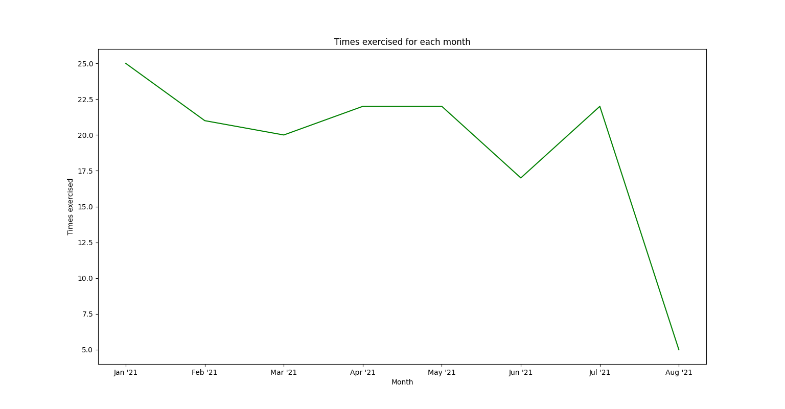
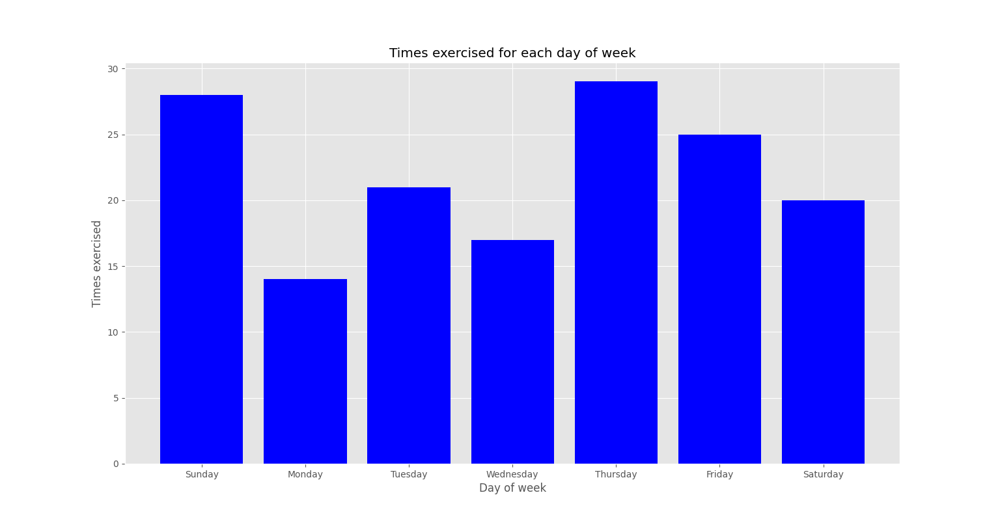
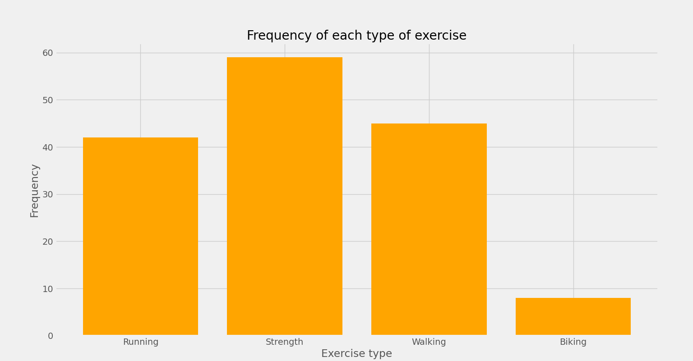

# Exercise Tracking and Visualization

This project provides a way to track and visualize your exercise habits. It provides 3 charts for visualizing exercise habits.

The first plots the number of times you exercised versus the month.

The second plots the number of times you exercised versus a particular day of week.

The third plots the number of times you performed a particular exercise type.

In addition, I have also provided an Excel spreadsheet template for others to track their exercise habits as well. The years and months should be integers and strings, respectively. Each column after the year and month represents an exercise; remove or add rows as required for your exercise habits and needs. Each cell in the exercise columns should be a comma separated list of integers, surrounded by brackets, that represent the days exercised for that particular year and month.
